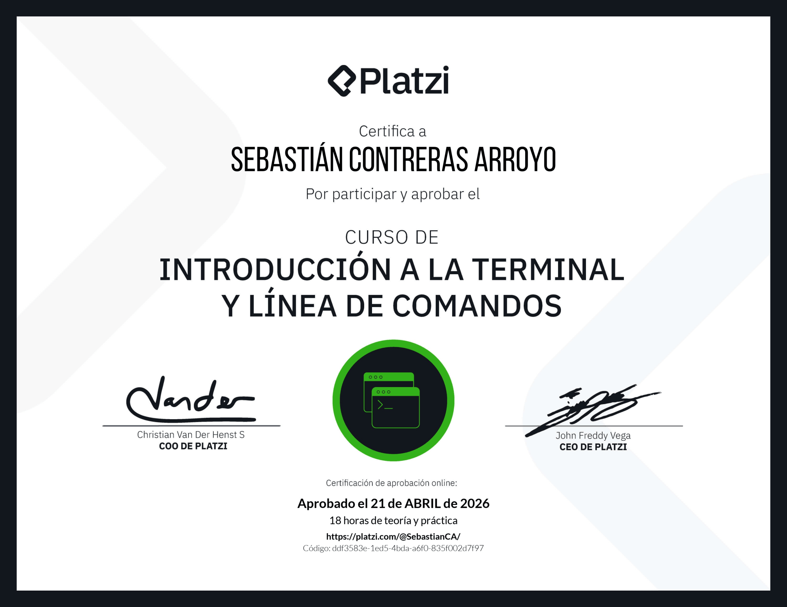

  

<h1 align="center">Linux Terminal & Command Line Fundamentals</h1>

  
  
  

This repository documents my learning journey through the **"Introduction to Terminal and Command Line"** course from Platzi.

The course focuses on building a strong foundation in **Linux terminal usage**, including file system navigation, file and directory manipulation, permissions, processes, and command-line tools such as `grep` and `curl`.

It also explores **shell customization, aliases, and workflow optimization**, providing practical command-line skills essential for backend, DevOps, and cloud environments.

---

## 📚 Course Overview

- Platform: Platzi  
- Level: Beginner  
- Classes: 26  
- Content: ~4 hours  
- Practice: ~14 hours

---

## 🏆 Certificate

Successfully completed the course and obtained certification validating practical Linux CLI skills.

  

  

---

## 🧠 Notes

This repository is part of my continuous learning path as a **Full-Stack Software Developer**.

It focuses on building practical **Linux CLI skills**, improving efficiency in terminal workflows, and strengthening foundations for backend, DevOps, and cloud environments.

---
